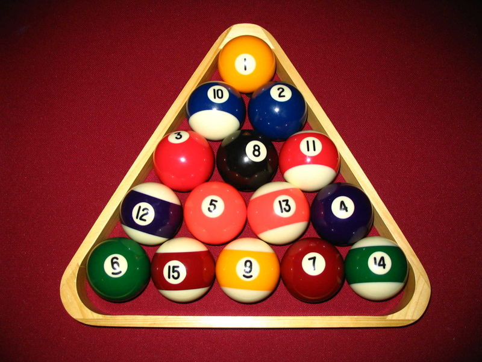

# Challenge #0

[Wikipedia article on pool/billiards balls](https://en.wikipedia.org/wiki/Billiard_ball#Pool)

## Problem

Write a function `pyramid` that accepts one argument `balls`, that returns the amount of complete levels of a billiards ball triangle that can be composed with that amount of balls.

For Example, a traditional billiards triangle in the game of pool has 15 balls and can be arranged into 5 levels.

* 6 balls would make 3 levels
* 10 balls would make 4 levels

Each level will contain one more ball than the last level.
