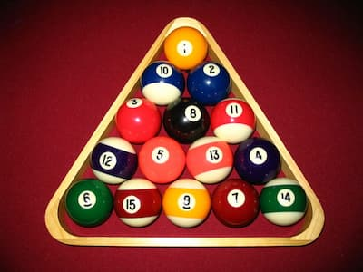

# Challenge #3 Billiard's Triangle

## Problem

Write a function `pyramid` that accepts one argument `balls`, that returns the amount of complete levels of a billiards ball triangle that can be composed with that amount of balls.

For Example, a traditional billiards triangle in the game of pool has 15 balls and can be arranged into 5 levels.

* 6 balls would make 3 levels
* 10 balls would make 4 levels

Each level will contain one more ball than the last level.

## Difficulty ⭐⭐

### Bonus!

You've been challenged to create a solution for the Guinness World Record attempt for largest billiard ball pyramid. Write your solution so that it's efficient enough to handle a massive quantity of balls.